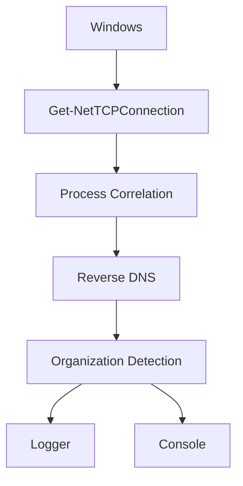

# 📡 Network Egress Monitor - v3.0 

[](https://microsoft.com/powershell)
[](https://microsoft.com/windows)
[](LICENSE)
[](https://github.com/Lucas18062025/NETWORK-EGRESS-MONITOR-)

**Real-time TCP Egress Monitoring for Windows 11 with Forensic Audit Context**


## Descripción

Network Egress Monitor is a PowerShell-based monitoring tool that captures outbound TCP connections in real time.

Each connection is correlated with:

- Process Name
- PID
- Reverse DNS
- Organization
- Timestamp
- User Context
- Operating System

The tool is intended for DFIR investigations, SOC monitoring, malware analysis and threat hunting.

## Installation

Clone repository

```powershell
git clone https://github.com/Lucas18062025/NETWORK-EGRESS-MONITOR.git
```

## Uso

```powershell
# Ejecución básica (intervalo 3 segundos)
.\monitor-egress.ps1

# Intervalo personalizado (1 segundo)
.\monitor-egress.ps1 -IntervalSeconds 1

# Con ejecución policy
powershell -ExecutionPolicy Bypass -File .\monitor-egress.ps1 -IntervalSeconds 1
```
## Captura en Vivo


## Features

✅ Real-time TCP monitoring

✅ Reverse DNS lookup

✅ Organization identification

✅ Process correlation

✅ Log generation

✅ Lightweight

✅ Native PowerShell

✅ No external dependencies


## Roadmap

- [ ] v3.1: Agregar alertas por Email
- [ ] v3.2: Exportar logs a CSV/JSON
- [ ] v3.3: Integración con Splunk/ELK
- [ ] v4.0: Versión GUI (WinForms)
- [ ] v4.1: API REST para queries remotas

---

## 👤 Autor

**Lucas Villagra**  
Cybersecurity Analyst | Ethical Hacker | SOC Analyst  
📍 San Miguel de Tucumán, Argentina

[](https://linkedin.com/in/lucas-villagra-cybersecurity)
[](https://github.com/Lucas18062025)
[](https://lucas18062025.github.io/Portafolio/)

---
