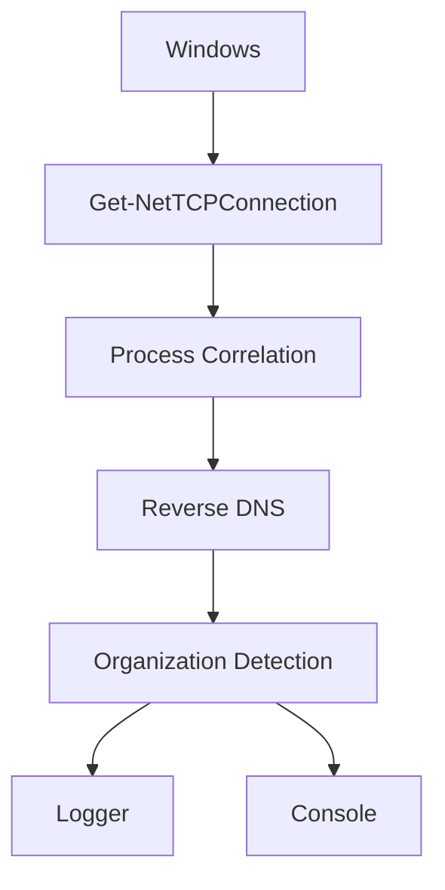

<p align="center">


</p>

           🛰️ NETWORK EGRESS MONITOR

       Time TCP Egress Monitoring for Windows

       PowerShell Native

       SOC

       DFIR

       Threat Hunting

       Blue Team
       
──────────────────────────────────────────────

       Real-Time Connections

       Reverse DNS

       Organization Detection

       Process Correlation

       Logging

       Windows Native


**LinkedIn:** [lucas-villagra-cybersecurity](https://linkedin.com/in/lucas-villagra-cybersecurity)

---

## Descripción

Network Egress Monitor is a PowerShell-based monitoring tool that captures outbound TCP connections in real time.

Each connection is correlated with:

- Process Name
- PID
- Reverse DNS
- Organization
- Timestamp
- User Context
- Operating System

The tool is intended for DFIR investigations, SOC monitoring, malware analysis and threat hunting.

## Installation

Clone repository

```powershell
git clone https://github.com/Lucas18062025/NETWORK-EGRESS-MONITOR.git
```

## Uso

```powershell
# Ejecución básica (intervalo 3 segundos)
.\monitor-egress.ps1

# Intervalo personalizado (1 segundo)
.\monitor-egress.ps1 -IntervalSeconds 1

# Con ejecución policy
powershell -ExecutionPolicy Bypass -File .\monitor-egress.ps1 -IntervalSeconds 1
```
SOC Monitoring

Threat Hunting

Incident Response

Malware Analysis

Digital Forensics

## Features

✅ Real-time TCP monitoring

✅ Reverse DNS lookup

✅ Organization identification

✅ Process correlation

✅ Log generation

✅ Lightweight

✅ Native PowerShell

✅ No external dependencies


